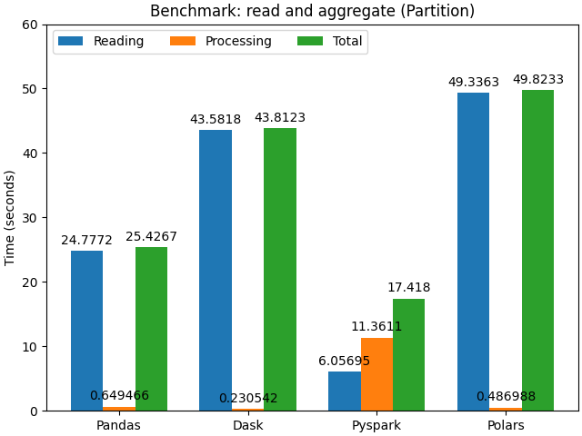

# ETL Data Pipeline

ETL pipeline that includes the generation of a synthetic dataset (10M records), transforming and loading the dataset to Parquet format both locally and to Google Cloud Storage, as well as reading and querying it using using Pandas, Polars, PySpark, or Dask. The pipeline is designed to handle large volumes of data, it employs multiprocessing for efficient dataset generation, and includes tests implemented with Pytest.

Considering the dataset generated, a benchmark module was implemented to compare the performance of Pandas, Polars, PySpark and Dask in terms of their reading and processing times.


## Setup
The project includes all the necessary configurations to run directly in VSCode + devcontainers.
To do this, you first need to save a `credentials.json` file in the root directory of the repository.
Then, create a `.env` file in the root directory with the following environment variables:
- GOOGLE_APPLICATION_CREDENTIALS=/app/credentials.json
- JAVA_HOME=/usr/lib/jvm/java-17-openjdk-amd64

These variables are essential for configuring credentials and access paths to GCP services, and for the correct functioning of Pyspark.
Finally, follow the usual steps to build the Docker image for the devcontainer and run the scripts as described below.

In the `resources` folder, you can find a [credentials](./resources/read_only_credentials.json) file with read-only access to the bucket. To fully execute all the scripts, it is recommended to create a GCP test account and grant full access to a dedicated bucket.


## Table of Contents

1. [Dataset Preparation](#dataset-preparation)
2. [Transform and Load to Parquet](#transform-and-load-to-parquet)
3. [Upload to Google Cloud Storage](#upload-to-google-cloud-storage)
4. [Read and Aggregate](#read-and-aggregate)
5. [Benchmark](#benchmark)


## Dataset Preparation

This script generates a synthetic dataset of 10 million records. The data includes the following fields: client_id, transaction_date, sales_amount, product_category, and sales_region.

The `NumPy` and `Polars` libraries are used to facilitate data generation and handling. Due to the large number of records, the generation process is divided into batches of 1 million records. Each batch is stored in a Polars DataFrame, which is generated in parallel using a `ProcessPoolExecutor`. This approach optimizes the script's efficiency and resource usage.

The program configuration is managed through a Config class, which allows defining essential parameters, such as the number of records, batch size, number of workers, random seed, output path for the CSV file, and logging level.

Usage:
```
python -m scripts.dataset_preparation.main
```

## Transform and Load to Parquet

This script transforms plain text files into Parquet files, with optional features such as partitioning and error handling. When error handling is not required, `Polars` is utilized to read the input file, process it, and output it as a Parquet file. On the other hand, when error handling is enabled, `PyArrow` is employed to read the input file, capture any invalid rows, save them to a quarantine file, and then generate the output Parquet file.

The script uses the argparse library to define various command-line arguments, allowing users to specify input and output paths, partition columns, error-handling options, and logging levels.

Usage:
```
python -m scripts.transform_load_to_parquet.main my_dataset.csv my_parquet.parquet
```

## Upload to Google Cloud Storage

This script uploads Parquet files to Google Cloud Storage using the google-cloud-storage library. It automatically creates a bucket if the one provided doesn't already exist. Depending on the files of the input directory, the script handles the upload of either a single file or multiple files concurrently.

Usage:
```
python -m scripts.upload_to_google_cloud.main my_dir/ my_bucket
```

## Read and Aggregate

For this seccion four scripts where implemented to read the Parquet file stored on GSC and doing aggregations such as getting the totals sales by category and the average sales by region. [`Pandas`](./scripts/read_and_aggregate/main_pandas.py), [`Dask`](./scripts/read_and_aggregate/main_dask.py), [`Pyspark`](./scripts/read_and_aggregate/main_pyspark.py) and [`Polars`](./scripts/read_and_aggregate/main_polars.py) where the libraries used on each implementation.

Usage:
```
python -m scripts.read_and_aggregate.main_polars gs://single_file/
```

## Benchmark

An object-oriented inheritance pattern was designed to facilitate the collection of results between the main modules, using the `time.perf_counter()` function to capture the measurements. The following images generated with `Matplotlib` show the measurement results:

### Single Parquet file
 

### Parquet files (partitions)


At first glance, the Polars implementation is superior in every aspect. Considering the data source size (74.42 MB for the single Parquet file and 70.87 MB for the partitions, each being around 11.80 MB), one could argue that handling files that can be stored in system memory is efficiently done with Pandas or Polars. On the other hand, while PySpark is optimized to handle large distributed datasets, the data source size in this benchmark is not large enough to justify the initialization and management of a Spark session, which leads to longer processing times compared to Pandas and Polars. Finally, even though Dask is a Pandas extension designed for parallel operations and limited memory environments, it introduces overhead in managing parallel tasks.

In conclusion, for handling large volumes of data, either Polars or PySpark would be a good option, with Polars excelling in single-machine scenarios and PySpark being advantageous in distributed environments. On the other hand, for datasets that fit in memory, using Polars or Pandas is a good choice.